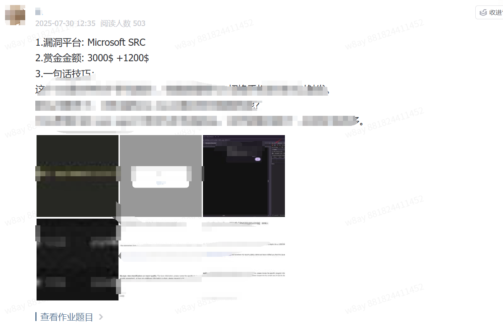
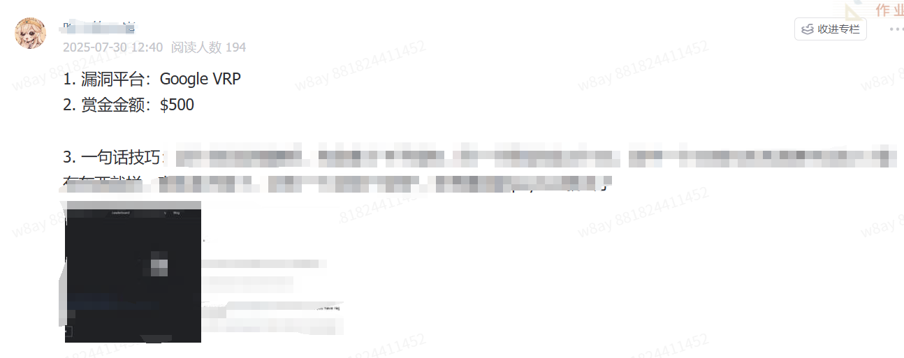
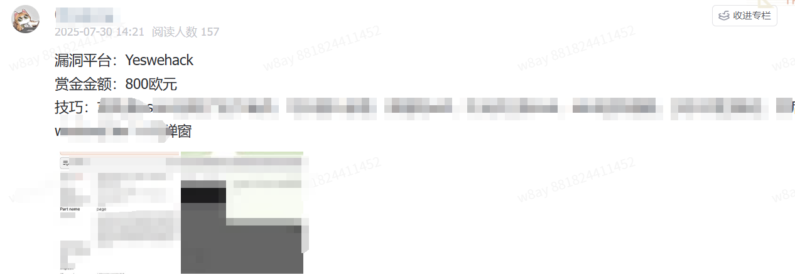
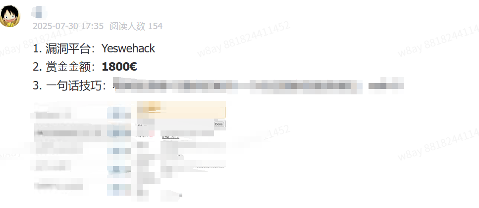
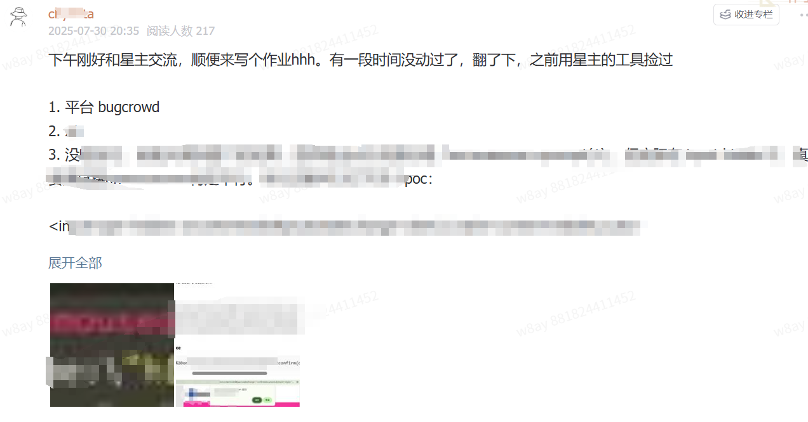
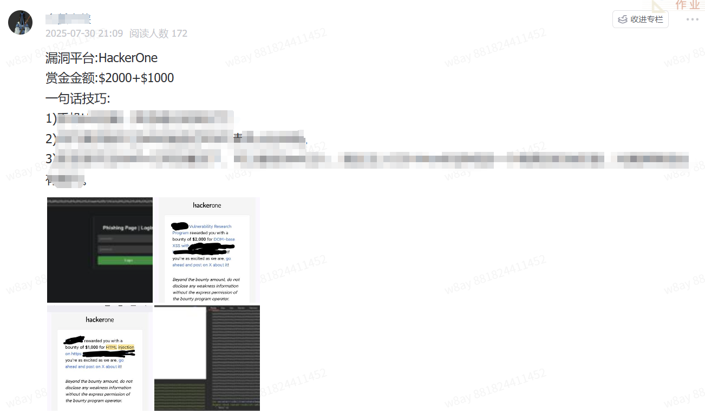

# 第七期：发布你的漏洞战报

## 🎯 作业目标

之前星球制定了okr：帮助星球朋友获得漏洞赏金平台赏金，所以想通过此活动了解真实的通过本星球获得的漏洞赏金。  

直接或间接使用星球内的工具、文章等获得了漏洞赏金，按照以下通过回复此作业即可参与此活动（可多次发帖，漏洞赏金累计计算）。

## 战报模板
```
漏洞平台：__（例：HackerOne）  
赏金金额：__（需附相关截图,敏感位置需打码）  
一句话技巧：__（简单描述发现过程中的思路，可以是失败的，可以是成功的，会按照思路内容给予现金奖励，如：通过xscan发现了隐藏参数xxx存在dom xss漏洞，尝试(尝试内容可多描述)bypass后绕过xx waf，成功弹窗获取赏金）
```

## 奖励内容
🚀 发布首个战报:  获得星球续费优惠券或新加入优惠券 ¥50    
🌍 邀请1位好友加入星球，获得邀请分成奖金，两位都能获得星球编纂的“《xscan bugbounty实战案例指南》”  
💡 赏金累计获得$1000 (美元),  获得xscan pro内测体验，xscan pro包含本地版在线webui+项目管理+下发任务  
🌈 赏金累计获得$2000(美元),  邀请加入核心bugbounty群。  

- 群内权益:内测资格: 第一时间内测自动化bugbounty最新工具
- 核心思路: 我会分享一些前沿、尚未公开的挖洞思路和技术细节。
- 平台情报: 自动化平台发现的“新上线”或“刚更新范围”的赏金项目会优先在群内同步。
- 直接对话: 和其他顶尖使用者直接交流，一起bugbounty

## 积分奖励
总积分 = 星球积分 + 发布战报获得累计赏金(美元)/100 计算

- 🚀 每个月积分排行榜，排行榜Top1奖励 200元现金+一年免费续期（由于发帖时间在7.30号，7月份并入8月计算）
- 🚀 年底年终总结，排行榜Top3奖励 500元现金+加入核心bugbounty群+成为星球嘉宾永久免费


最终解释权归“Hacking自动化就是好玩”知识星球所有。

## 优秀星友作业集












