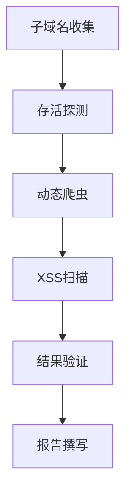

# 实战经验

本章节分享一些在 Bug Bounty 实战中的经验和思考。

## 🚀 我自动化获得微软漏洞赏金的经历

这是一个通过自动化发现微软漏洞并获得赏金的真实案例。

### 核心思想
利用信息搜集和自动化脚本，监控目标的资产变化，并对新发现的资产进行快速的漏洞扫描。

### 自动化步骤
1.  **资产监控**：编写脚本，定期爬取微软的 Bug Bounty 项目页面，监控其资产范围（scope）的变化。
2.  **增量发现**：当发现有新的域名或 IP 段加入范围时，脚本会触发通知。
3.  **快速扫描**：对新发现的资产，立即使用自动化工具进行端口扫描、目录爆破和指纹识别。
4.  **漏洞探测**：在一个新上线的子域名上，发现了一个调试接口被暴露在公网。
5.  **漏洞验证**：通过该接口，可以读取到部分敏感配置信息。
6.  **报告提交**：将发现的漏洞提交给微软，并成功获得了赏金。

### 经验总结
- **速度至上**：新上线的资产通常防御较弱，是漏洞的高发区。自动化监控和快速响应是关键。
- **深度挖掘**：不要只停留在表面的 Web 漏洞，关注非标准的端口和服务，可能会有意外发现。

> [点击阅读原文](https://t.zsxq.com/a6Aie2f)

## 🎯 我的 XSS Bug Bounty 自动化步骤

这套流程是我个人在挖掘 XSS 漏洞时，结合自动化工具使用的一套方法论。

### 流程概览

### 步骤详解
1.  **子域名收集**：
    -   使用 `subfinder`, `ksubdomain` 等工具，尽可能全面地收集目标的所有子域名。
    -   结合 `assetfinder` 等其他工具，扩大收集范围。

2.  **存活探测**：
    -   使用 `httpx` 或 `naabu` 对收集到的子域名进行存活探测，筛选出开放 Web 服务的站点。

3.  **动态爬虫**：
    -   使用 `crawlergo` 或星球专属爬虫，对存活的 Web 站点进行深度爬取，获取尽可能多的 URL 和参数。
    -   这一步非常关键，爬虫的质量直接决定了后续扫描的覆盖面。

4.  **XSS 扫描**：
    -   将爬虫获取的 URL 列表，喂给 **XScan** 进行自动化扫描。
    -   XScan 会自动分析参数，并使用其内置的引擎进行漏洞探测。

5.  **结果验证**：
    -   对 XScan 报出的疑似漏洞进行手动验证。
    -   使用浏览器开发者工具，分析 DOM 结构和 JavaScript 执行流程，确认漏洞的可利用性。

6.  **报告撰写**：
    -   清晰地描述漏洞的触发点、Payload 和危害。
    -   提供详细的复现步骤和截图。

### 核心理念
- **全面性**：资产收集要尽可能全面。
- **深度**：爬虫要尽可能深入，覆盖更多的动态页面。
- **精准**：扫描器要足够智能，能够精准地发现和验证漏洞。

> [点击阅读原文](https://t.zsxq.com/05jIqrnEu) 