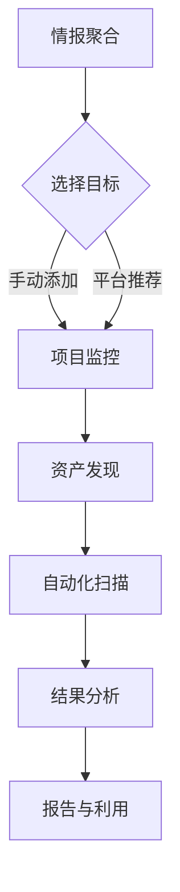
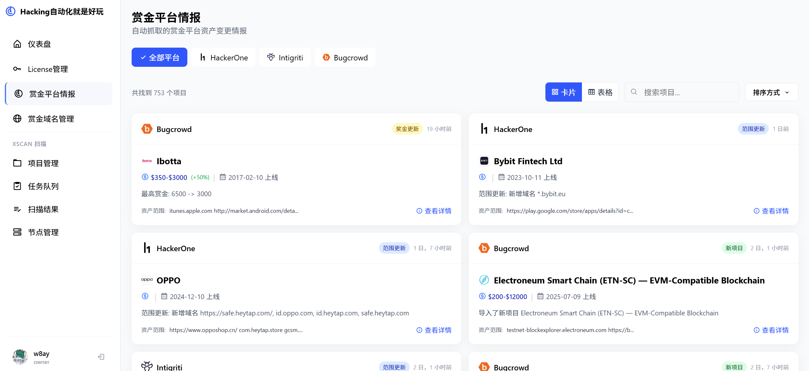
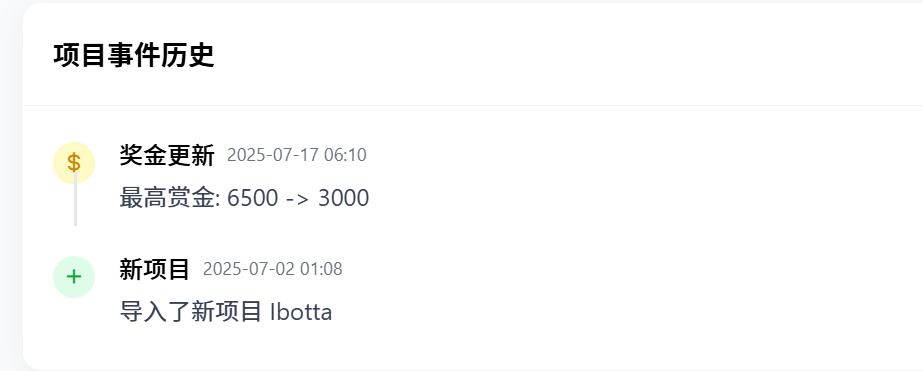
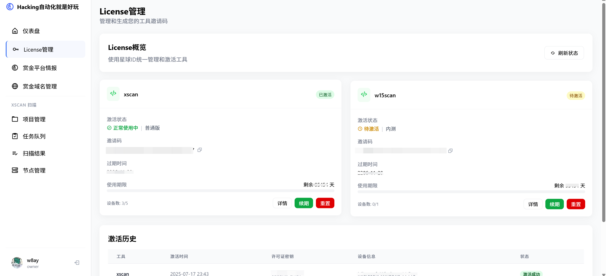

# BugBounty平台 使用

本章节将介绍星球专属 Bug Bounty 平台的主要使用方法和功能模块。

> **注意**：平台目前仍在开发中，实际界面和操作可能有所不同。

## 🚀 核心使用流程

平台的使用被设计为情报驱动的自动化流程：

1.  **情报聚合**：平台首页会展示从各大赏金平台聚合的最新情报，如新项目、新资产等。
2.  **选择目标**：你可以从平台推荐的情报中选择目标，也可以手动添加你感兴趣的项目。
3.  **项目监控**：将目标加入监控列表后，平台会开始对它进行持续监控。
4.  **资产发现**：自动为目标收集子域名、IP等资产信息。
5.  **自动化扫描**：调用集成的扫描工具（如XScan）对发现的资产进行自动化漏洞扫描。
6.  **结果分析**：在平台查看扫描结果，分析潜在的漏洞。
7.  **报告与利用**：利用发现的漏洞，撰写报告并提交给赏金平台。

## 🌟 功能模块详解

### 1. 情报中心 (Intelligence)
- **功能**：展示 HackerOne, Bugcrowd 等平台的最新动态。
- **使用**：每日浏览，发现有潜力的新项目。

获取项目的历史变更动态

### 2. License管理

- **功能**：License 激活星球专属工具
- **使用**：
    - 在此页面获取你的专属 License Key。
    - 将 Key 配置到 XScan, W15Scan 等工具中以激活使用。

### 4. 扫描任务 (Scan)
- **功能**：配置和管理xscan扫描任务。
- **使用**：
    - 请参考 [xscan在线扫描](../xscan/activation.md) 章节

---
这个平台将是你进行 Bug Bounty 的作战指挥中心，希望能帮助你更上一层楼。 