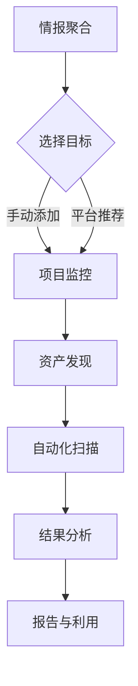

# BugBounty平台 使用

本章节将介绍星球专属 Bug Bounty 平台的主要使用方法和功能模块。

> **注意**：平台目前仍在开发中，以下为规划中的功能，实际界面和操作可能有所不同。

## 🚀 核心使用流程

平台的使用被设计为情报驱动的自动化流程：

1.  **情报聚合**：平台首页会展示从各大赏金平台聚合的最新情报，如新项目、新资产等。
2.  **选择目标**：你可以从平台推荐的情报中选择目标，也可以手动添加你感兴趣的项目。
3.  **项目监控**：将目标加入监控列表后，平台会开始对它进行持续监控。
4.  **资产发现**：自动为目标收集子域名、IP等资产信息。
5.  **自动化扫描**：调用集成的扫描工具（如XScan）对发现的资产进行自动化漏洞扫描。
6.  **结果分析**：在平台查看扫描结果，分析潜在的漏洞。
7.  **报告与利用**：利用发现的漏洞，撰写报告并提交给赏金平台。

## 🌟 功能模块详解

### 1. 情报中心 (Intelligence)
- **功能**：展示 HackerOne, Bugcrowd 等平台的最新动态。
- **使用**：每日浏览，发现有潜力的新项目。

### 2. 我的项目 (My Projects)
- **功能**：管理你正在关注和监控的赏金项目。
- **使用**：
    - 点击“添加项目”，输入目标的根域名或项目链接。
    - 在项目列表中，可以查看每个项目的资产数量、漏洞数量和监控状态。

### 3. 资产管理 (Assets)
- **功能**：展示指定项目下的所有资产，如子域名、IP、URL等。
- **使用**：
    - 查看平台自动发现的资产。
    - 手动添加或移除资产。
    - 点击某个资产，可以查看其详细信息，如开放端口、指纹信息等。

### 4. 扫描任务 (Scans)
- **功能**：配置和管理扫描任务。
- **使用**：
    - 选择要扫描的项目或资产。
    - 选择扫描模板（如：XSS专项扫描）。
    - 查看扫描任务的进度和历史记录。

### 5. 漏洞管理 (Vulnerabilities)
- **功能**：汇总所有扫描任务发现的漏洞。
- **使用**：
    - 对漏洞进行排序和筛选（如按危害等级、按资产）。
    - 查看漏洞详情，包括请求和响应。
    - 管理漏洞状态（如：待处理、已确认、已修复）。

### 6. 知识库 (Knowledge Base)
- **功能**：浏览和搜索星球沉淀的 Bug Bounty 实战文章和技巧。
- **使用**：遇到问题时，在知识库中搜索相关的解决方案或思路。

### 7. 工具授权 (License)
- **功能**：统一管理你的星球工具 License。
- **使用**：
    - 在此页面获取你的专属 License Key。
    - 将 Key 配置到 XScan, W15Scan 等工具中以激活使用。

---
这个平台将是你进行 Bug Bounty 的作战指挥中心，希望能帮助你更上一层楼。 