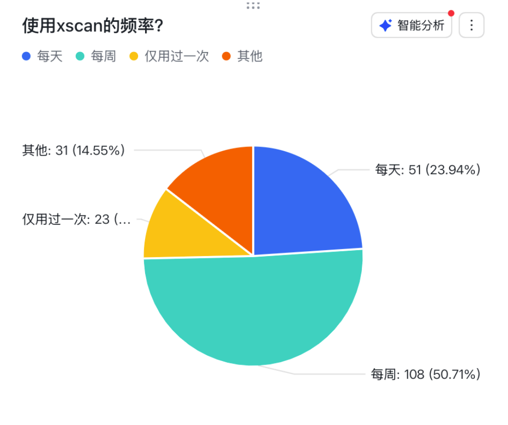
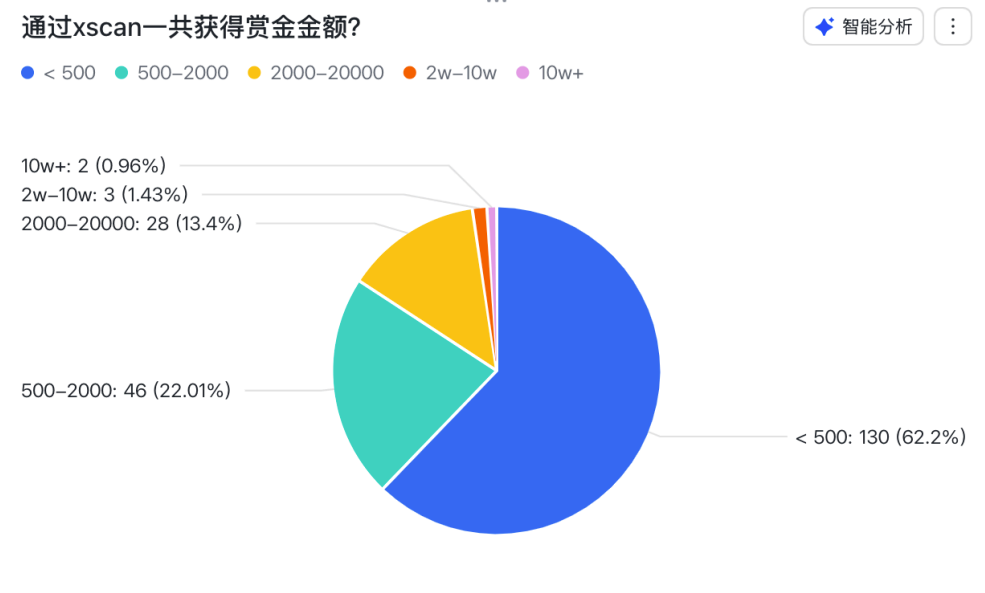

#  星球概述 

## Hacking自动化就是好玩

欢迎来到 **Hacking自动化就是好玩** 知识星球！这里是一个专注于漏洞赏金（Bug Bounty）自动化、红队开发和武器化的技术社区。

## 📖 星球说明

这里探索漏洞赏金 bug bounty 相关的自动化、红队开发以及武器化，研究有趣的工具和代码原理，训练和微调网络安全领域自己的大模型。

> 许多黑客和安全工具的构造都非常巧妙，我阅读了许多安全工具的代码，并记录下了其中值得学习的部分。将开发与安全结合起来，自动化的黑客攻击是非常有趣的，付费加入是我更新的动力。本星球将持续更新一些最好的文章、源代码和思路。

## 🎯 星球目标与OKR

### 主要目标
**自动化 bugbounty 霸榜漏洞平台**

### 星球OKR

2025-06-27 更新：**帮助星球朋友获得漏洞赏金平台赏金和自动化获取赏金平台的成果**

## 🛠️ 主要内容

### 工具开发
- **XSCAN**：专业的XSS自动化扫描器
- **W15Scan**：攻击面管理平台
- **BugBounty平台**：赏金信息聚合与监控

### 技术分享
- 安全工具源码分析
- 漏洞挖掘技巧
- 自动化脚本开发
- 红队工具武器化

### 学习体系
- 系统性的星球作业
- 完整的安全补全计划
- 实战项目驱动学习

## 📊 星球成果

根据最新的用户反馈统计：

### 工具使用情况

- **25%** 用户每日使用
- **50%** 用户每周使用
- **80%** 用户已通过工具获得漏洞

### 赏金收获

- **62%** 用户赚到第一笔赏金（≤500美元）
- **22%** 用户斩获 500-2000美元
- **5位** 大佬累计收入超2万美元

### 企业应用
- 多家甲方将工具集成到内部安全平台
- 团队用作SRC众测的自动化验证工具
- 满意度超过**90%**（4分和5分）

---

**感谢你们照亮这个星球，更感谢你们，让我始终相信技术人的浪漫。** ❤️ 