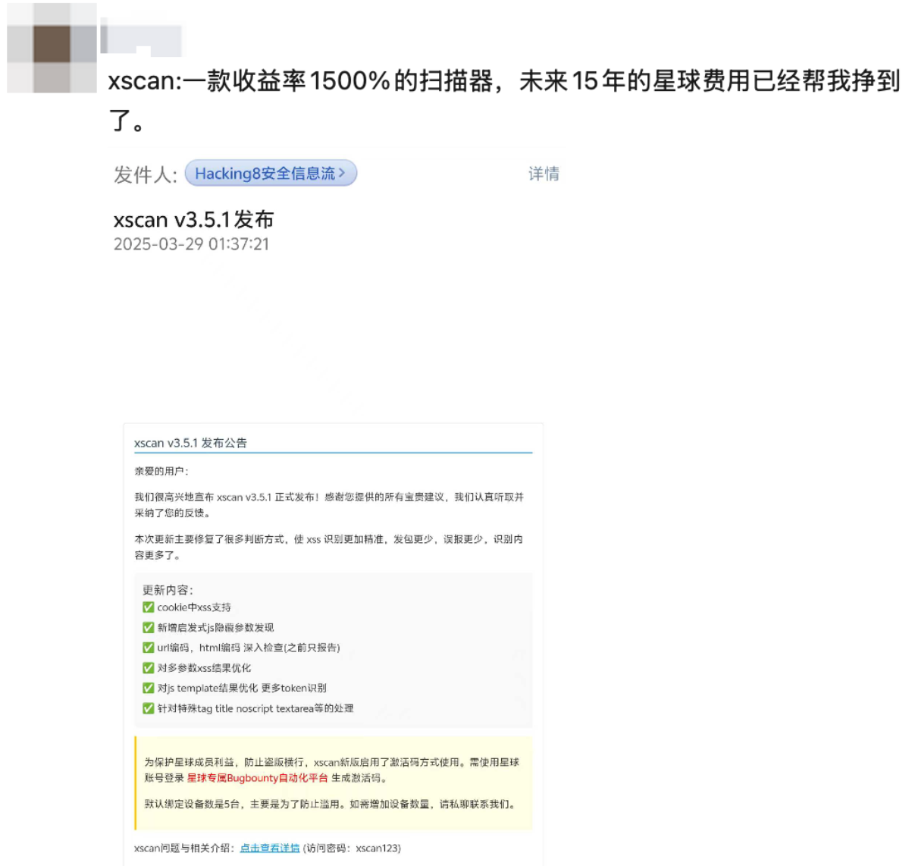
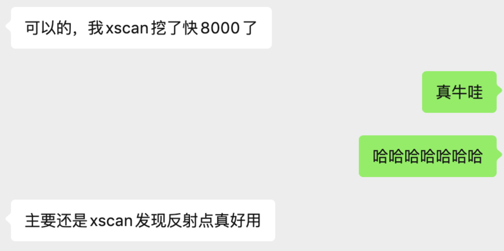

# 费用说明

感谢您对 **Hacking自动化就是好玩** 知识星球的关注和支持！

## 💰 加入费用

星球目前的价格为 **￥356 元/年**。每天不到一块钱，挖一个漏洞就能获得多倍汇报。

星友朋友圈  


星友评价(单位:美金)  


随着星球内容的不断丰富、星球人数增多、专属工具的迭代以及知识星球API费用，星球的价格未来可能会上调。

## 🎁 星球长期活动

直接或间接使用星球内的工具、文章等获得了漏洞赏金，按照以下通过回复此作业即可参与此活动（可多次发帖，漏洞赏金累计计算）。

```
[战报模板]  
漏洞平台：__（例：HackerOne）  
赏金金额：__（需附相关截图,敏感位置需打码）  
一句话技巧：__（ 简单描述发现过程中的思路，可以是失败的，可以是成功的，会按照思路内容给予现金奖励，如：通过xscan发现了隐藏参数xxx存在dom xss漏洞，尝试(尝试内容可多描述)bypass后绕过xx waf，成功弹窗获取赏金）
```

**奖励内容**
🚀 发布首个战报:  获得星球续费优惠券或新加入优惠券 ¥50    
🌍 邀请1位好友加入星球，获得邀请分成奖金，两位都能获得星球编纂的“《xscan bugbounty实战案例指南》”  
💡 赏金累计获得$1000 (美元),  获得xscan pro内测体验，xscan pro包含本地版在线webui+项目管理+下发任务  
🌈 赏金累计获得$2000(美元),  邀请加入核心bugbounty群。  

- 群内权益:内测资格: 第一时间内测自动化bugbounty最新工具
- 核心思路: 我会分享一些前沿、尚未公开的挖洞思路和技术细节。
- 平台情报: 自动化平台发现的“新上线”或“刚更新范围”的赏金项目会优先在群内同步。
- 直接对话: 和其他顶尖使用者直接交流，一起bugbounty

**积分奖励**  
总积分 = 星球积分 + 发布战报获得累计赏金(美元)/100 计算

- 🚀 每个月积分排行榜，排行榜Top1奖励 200元现金+一年免费续期（由于发帖时间在7.30号，7月份并入8月计算）
- 🚀 年底年终总结，排行榜Top3奖励 500元现金+加入核心bugbounty群+成为星球嘉宾永久免费


### 精华文章标准
- **原创性**：内容必须是原创，禁止抄袭。
- **技术性**：包含深入的技术分析、实战经验或独特的工具思路。
- **价值性**：对其他星球成员有学习和参考价值。
- **完整性**：文章结构完整，逻辑清晰，图文并茂。

## ❓ 常见问题

**Q: 为什么星球需要付费？**

A: 许多黑客和安全工具的构造是那么巧妙，我看了很多安全工具的代码，将它们值得学习的地方记录了下来。这个仓库将持续更新星球中的精华文章和补全安全知识，记录笔记，对自己对他人都是一种收获。付费是我持续创作和更新的动力，同时也能保证星球内容的质量和成员的交流环境。

**Q: 价格会上涨吗？**

A: 会的。随着星球的持续发展和API等成本的支出，控制星球工具的使用量，未来会继续适度涨价，以保证星球的健康运营。老成员续费时将享受优惠。

**Q: 如何申请免费续费？**

A: 当您参加活动或发表过精华文章后，请通过知识星球App私信或微信联系我，提供您的星球ID和精华文章链接，即可为您免费续费。 