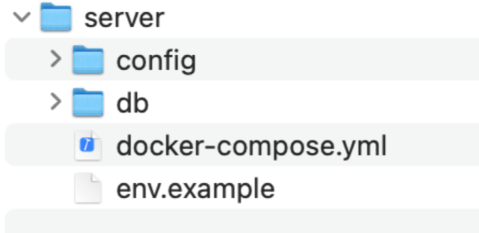
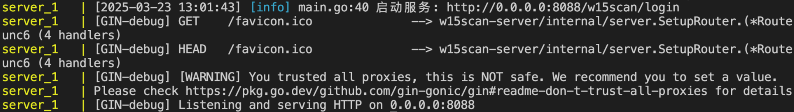
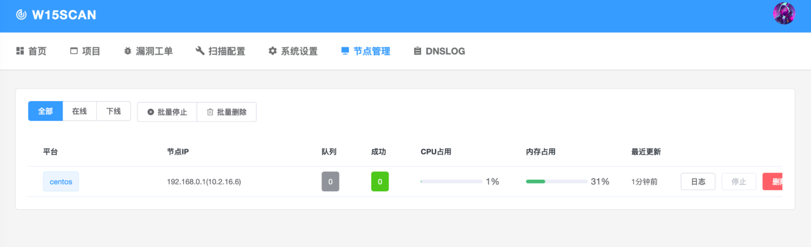

# 安装教程

**推荐配置**

**最低配置**：4C8G

下载最新w15scan: https://wx.zsxq.com/tags/w15scan/51122541281824  

## WEB端安装

### 系统架构

server端结构如图：



- **config**：扫描器各类配置文件，包含指纹、poc、字典等，与web端实时同步，方便后续迁移或升级
- **db**：数据库持久化文件
- **env.example**：环境变量

### 安装步骤

#### 1. 配置环境变量

重命名 `env.example` 为 `.env`，修改其中变量：

```bash
MONGO_HOST=mongodb           # 使用docker启动时不要修改此项
MONGO_USERNAME=w15scan       # mongo用户名
MONGO_PASSWORD=w15scan!pass  # mongo密码
WEB_ADMIN_USERNAME=admin233  # web端用户名
WEB_ADMIN_PASSWORD=admin234  # web端密码
WEB_KEY=this_is_a_secret_key # 与client通讯的key
LOGIN_PATH=/w15scan/login    # 登录路径,防止被空间引擎探测溯源
```

**注意**：
- 测试时可以使用默认配置
- 线上版本建议修改所有默认值

#### 2. 安装Docker环境

下载并安装 `docker` 和 `docker-compose`

#### 3. 启动服务

```bash
# 启动服务
docker-compose up -d

# 查看日志
docker-compose logs
```

#### 4. 验证安装

看到类似以下 `Listening and serving HTTP` 即代表启动成功：



#### 5. 登录系统

按照设置的后缀登录，默认地址：

```
IP:8088/w15scan/login
```

使用配置的用户名密码登录系统。

## Client端安装

client端可在任意机器上单独部署，通过修改yaml配置文件和主机保持一致即可。

### 设计特点

client扫描端为红队设计：
- **只与server端交互**
- **无需其他依赖**
- **方便隐蔽和一键部署**

### 安装步骤

#### 1. 安装依赖

运行 `client_setup.sh` 安装必须依赖（ubuntu/debian）：

```bash
./client_setup.sh
```

**其他系统**：请自行依照脚本内容安装相应依赖

#### 2. 配置连接

修改 `config.yaml`：

```yaml
web_api: http://127.0.0.1:8088 # web端地址，后面不加斜杠
web_key: "this_is_a_secret_key"
```

#### 3. 启动Client

```bash
# 需要root权限运行
sudo ./client
```

#### 4. 验证连接

运行节点后可在web端节点管理看到节点状态：



## 部署注意事项

### 性能优化

由于扫描端使用无状态扫描技术，在docker上有性能瓶颈，**建议直接二进制运行在节点服务器中**。

### 网络配置

- **web端**：需要部署到公网，供client端连接
- **扫描端**：任意部署，只需要能访问web端即可

### 安全建议

1. **修改默认密码**：生产环境必须修改所有默认密码
2. **自定义登录路径**：修改 `LOGIN_PATH` 防止被扫描探测
3. **网络隔离**：client端建议部署在隔离网络中
4. **定期备份**：定期备份config和db目录

## 故障排除

### 常见问题

#### Docker启动失败
- 检查docker和docker-compose版本
- 确认端口8088未被占用
- 检查.env文件配置是否正确

#### Client连接失败
- 确认web_api地址可访问
- 检查web_key是否一致
- 确认防火墙设置

#### 扫描性能问题
- 使用二进制版本而非docker
- 调整并发配置
- 确认网络带宽充足

### 日志查看

```bash
# 查看web端日志
docker-compose logs -f

# 查看client端日志
./client -debug
```

## 更新升级

### web端更新

```bash
# 停止服务
docker-compose down

# 更新镜像
docker-compose pull

# 重启服务
docker-compose up -d
```

### client端更新

```bash
# 停止当前client
killall client

# 替换二进制文件
cp new_client ./client

# 重启服务
sudo ./client
```

### 配置迁移

由于所有配置都在config目录中，升级时只需要：

1. 备份config目录
2. 升级系统
3. 恢复config目录
4. 重启服务 