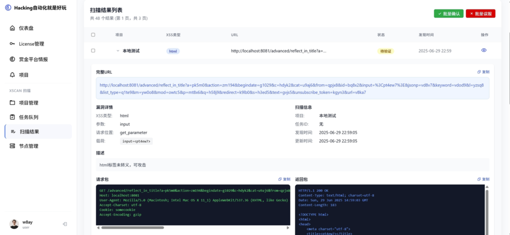

# 激活码与在线扫描

## 激活码获取

加入《**Hacking自动化就是好玩**》知识星球🌍满三天后，进入星球专属bugbounty自动化平台：

👉 **https://zsxq.w8ay.fun/**

在平台中生成激活码即可。

注意：xscan最新版仅在第一次使用时进行联网激活验证，后续均离线验证。

### 激活码说明

- **到期时间**：激活码到期时间为星球到期时间
- **续期方式**：续费后可点击续期
- **设备限制**：xscan激活码默认绑定5台设备，若超出可在平台重置，重置后绑定设备将清空。

## XSCAN在线扫描

xscan可以直接作为扫描节点启动，在星球专属bugbounty平台创建项目，填写范围后，会自动下发任务到扫描节点，可以在本地或者网页获得结果。

### 操作步骤

#### 1. 节点管理 - 生成注册命令

在自己服务器运行对应命令

#### 2. 项目管理 - 新增项目

也可以从赏金平台情报中新增xscan项目，每个项目可以配置独立的xscan配置

#### 3. 项目管理中点击加入扫描队列

#### 4. 扫描结果查看，确认状态

### 在线扫描优势

- **分布式扫描**：可以部署多个扫描节点
- **统一管理**：通过Web界面统一管理扫描任务
- **实时监控**：实时查看扫描进度和状态
- **结果汇总**：自动汇总所有节点的扫描结果
- **配置管理**：支持为不同项目配置独立的xscan参数

### 使用场景

- **大规模扫描**：需要扫描大量目标时
- **团队协作**：多人协作进行漏洞挖掘
- **长期监控**：对重点目标进行长期监控
- **批量处理**：从赏金平台批量导入目标进行扫描
