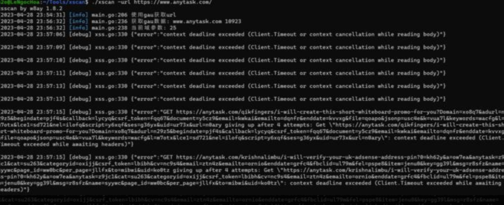

# 常见问题 FAQ

## 使用技巧 Tips

### 相似度调优

- **similarity相似度阈值**：若发现网站基本一样，相似度可以调高0.98~0.99，其他默认0.95就很高了
- **DOM相似度算法**：similarity阈值灵活运用，若发现网站基本一样，相似度可以调高0.98~0.99，其他默认0.95就很高了

### 调试配置

- 想要了解返回包细节，可将`response`设置为`True`
- 扫描完毕后通知，将`finish_notify`设置为`True`，支持bark、dingding、feishu的消息通知。

### 范围控制

- 不限范围扫XSS，将`no_scope`设置为`True`
- 如果目标url是www.example.com，将限制爬虫范围为 *.example.com，可指定配置only_root_scope为`True`
- 精准控制范围：`xscan spider --inscope *.example.com,www.baidu.com`  域名范围，逗号分割,防止爬虫跑偏

## 常见问题解答

### Q: 第一次使用xscan出现debug信息，这是错误吗？

**A:** debug信息用于调试，不是错误，可以无视。



这些debug输出是正常现象，不影响扫描功能。

### Q: 如何提高扫描效率？

**A:** 可以通过以下方式优化：

1. **调整并发数**：根据服务器性能调整`concurrency`参数
2. **设置相似度过滤**：启用DOM相似度算法过滤相同网站
3. **合理设置深度**：根据目标网站调整`max_depth`参数
4. **使用黑名单**：过滤掉不必要的域名

### Q: 扫描过程中遇到超时怎么办？

**A:** 可以调整以下配置：

- 增加`timeout`值（默认30秒）
- 降低`concurrency`并发数
- 调整`limit`每秒请求限制

### Q: 如何减少误报？

**A:** xscan采用语义化检测，检测成功率百分之百，基本不会产生误报。如果发现疑似误报，请反馈给开发团队。

### Q: 支持哪些通知方式？

**A:** 目前支持：

- **钉钉**：配置token和secret
- **飞书**：配置token和secret  
- **Bark**：配置server和token

### Q: 可以扫描哪些类型的XSS？

**A:** xscan支持检测：

- **反射型XSS**
- **DOM-XSS**
- **XML-XSS**

### Q: 如何处理需要登录的网站？

**A:** 在config.yaml中配置Cookie：

```yaml
headers:
  Cookie: your_session_cookie_here
```

或配置spider中cookie参数，可以设定指定域名指定cookie

```yaml
cookies:
	"*.example.com": "cookie1=1;cookie2=2"
	"a.example2.com": "cookie3=3;cookie4=4"
```

### Q: 扫描结果如何查看？

**A:** 扫描结果支持多种格式：

- **控制台输出**：实时显示扫描进度
- **JSON格式**：便于程序处理
- **Markdown格式**：便于阅读和报告

### Q: 为什么有些靶场xss扫描不到？

**A:** 部分靶场网页设置比较简单，容易被xscan相似度算法忽略。
想要测试靶场，可以关掉gau，关闭similarity_url、similarity_page_dom设置，只开启simile_hash

## 故障排除

### 证书问题

如果使用proxy模式遇到证书问题：

1. 确保已生成证书：`./xscan proxy --generate-ca`
2. 信任`certs/cacert.pem`证书
3. 配置浏览器代理为`127.0.0.1:8080`

### 网络连接问题

- 检查目标网站是否可访问
- 确认代理配置是否正确
- 检查防火墙设置

### 性能问题

- 根据服务器配置调整并发数
- 启用相似度过滤减少重复扫描
- 合理设置扫描深度和页面数量限制

## 反馈和支持

如果遇到其他问题，可以：

1. 在知识星球中反馈
2. 查看更新日志了解最新修复

## 更新建议

定期关注星球动态获取：

- **新版本发布**
- **功能更新**
- **已知问题修复**
- **使用技巧分享** 