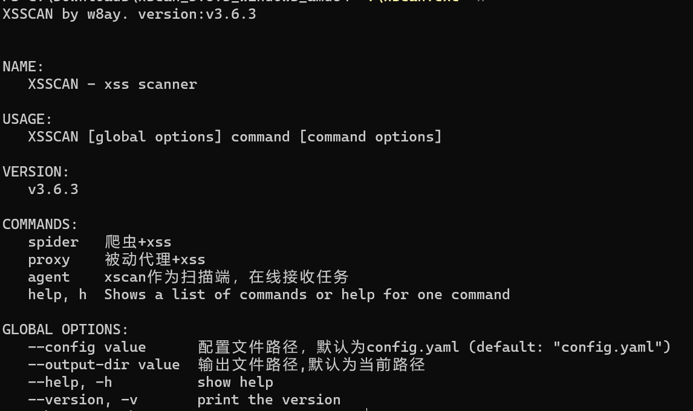

# 工具介绍

## 什么是 XSCAN

xscan是 **Hacking自动化就是好玩** 知识星球推出的自动化XSS扫描器，不同于市面上开源扫描器，xscan的检测方式和爬虫都是独一无二的。根据自己和群友多人挖洞经验，内置一系列刷src的trick检测点。

只需要确定漏洞赏金项目的范围(甚至只需要输入类似 `*.example.com` 的域名)，xscan会自动爬虫，自动js分析，自动xss探测，自动出结果报告，以实现自动化bugbounty躺赚。

xscan早期版本已开源：https://wx.zsxq.com/group/15522244414512/topic/811224515254882

## 核心特点

### 语义化检测

xscan采用了业界领先的语义化检测技术，这是区别于传统XSS扫描器的核心优势：

**技术原理**  
- **无害payload**：发送特制的无害测试载荷，不会对目标网站造成任何影响或破坏
- **AST语法树分析**：将响应内容转换为抽象语法树（Abstract Syntax Tree），从语义层面分析DOM结构变化
- **DOM差异检测**：通过对比注入前后的DOM结构，精确识别XSS执行点
- **上下文感知**：智能识别不同的HTML上下文环境（属性值、标签内容、JavaScript代码块等）

**检测优势**  
- **准确率100%**：基于语义分析，消除传统基于字符串匹配的误报问题
- **零误报**：不依赖特征码匹配，而是通过实际的DOM变化验证漏洞存在
- **绕过WAF**：无害payload天然具备WAF绕过能力，不触发安全防护
- **深度检测**：能够发现复杂的DOM-XSS和存储型XSS

**实际应用**  

- **Bug Bounty友好**：无害检测方式符合各大漏洞赏金平台的测试规范
- **生产环境安全**：可以在生产环境中安全运行，不影响业务正常运转
- **合规测试**：满足企业内部安全测试的合规要求

### 相似度爬虫

xscan内置的相似度爬虫系统是专门为XSS扫描优化的智能爬虫：

**相似度算法**  
- **页面内容相似度**：基于页面DOM结构、文本内容计算相似度
- **URL模式识别**：识别参数化URL模式，避免重复爬取相同结构的页面
- **表单结构分析**：分析表单字段相似性，优先爬取结构差异较大的表单
- **动态阈值调整**：根据网站特点自动调整相似度阈值

**效率优化**  
- **智能过滤**：自动过滤90%以上的重复或相似页面
- **优先级队列**：高价值页面优先爬取（如登录页、管理后台、表单页面）
- **深度控制**：智能控制爬虫深度，避免陷入无限循环
- **资源节约**：大幅减少无效请求，节省时间和带宽资源
 
**爬虫特色**  
- **JavaScript渲染**：支持SPA单页应用和动态内容渲染
- **表单自动填充**：智能识别表单字段，自动填充测试数据
- **Cookie管理**：自动管理会话状态，保持登录状态持续爬取
- **反反爬策略**：内置多种反反爬机制，应对各种反爬虫措施

### 一键自动化扫描

xscan的自动化能力是其最核心的竞争优势，实现了真正意义上的"一键躺赚"：

**全流程自动化**  
- **资产发现**：从单个域名自动扩展到整个攻击面
- **智能爬虫**：自动发现所有可能的入口点和参数
- **漏洞检测**：对每个发现的参数点进行XSS测试
- **结果验证**：自动验证漏洞的真实性和可利用性
- **报告生成**：自动生成详细的漏洞报告和PoC

**智能去重算法**  
- **URL去重**：基于URL结构和参数模式的智能去重
- **参数去重**：识别相同功能的参数，避免重复测试
- **响应去重**：基于响应内容相似度避免重复分析
- **漏洞去重**：自动合并相同类型的漏洞，避免重复报告

**扫描策略优化**  
- **渐进式扫描**：从浅到深，逐步增加扫描深度
- **负载均衡**：智能分配扫描任务，避免对目标造成压力
- **异常恢复**：网络异常时自动重试和断点续传
- **资源监控**：实时监控扫描进度和资源使用情况

### 多模式支持

xscan支持所有主流的XSS攻击向量，确保漏洞发现的全面性：

**支持的注入点**  
- **GET参数**：URL查询参数注入检测
- **POST参数**：表单数据和JSON数据注入
- **Cookie参数**：Cookie值注入检测
- **HTTP Header**：自定义请求头注入检测
- **URI路径**：URL路径参数注入检测

**检测技术**  
- **反射型XSS**：立即回显的XSS漏洞检测
- **DOM型XSS**：基于JavaScript的DOM操作XSS检测

**上下文适配**  
- **HTML上下文**：标签内容、属性值等不同位置的注入
- **JavaScript上下文**：JS代码块、事件处理器中的注入
- **CSS上下文**：样式表中的注入检测
- **URL上下文**：href、src等URL属性中的注入
- ... 等等

**编码绕过**  
- **多重编码**：支持HTML、URL、JavaScript、base64等多种编码方式
- **编码组合**：自动尝试各种编码组合绕过过滤
- **字符集测试**：测试不同字符集下的注入可能性
- **大小写变换**：利用大小写不敏感特性绕过过滤

## 下载地址

加入星球后，xscan下载可访问 [https://wx.zsxq.com/dweb2/index/tags/xscan/51122845584184](https://wx.zsxq.com/dweb2/index/tags/xscan/51122845584184) 下载最新版本。

## 主要功能模式

xscan提供三大子命令：

- **spider** - 爬虫+xss扫描模式
- **proxy** - 被动代理+xss扫描模式
- **agent** - xscan可作为扫描节点，由网页端下发指令执行

爬虫模式只需要输入url，便会自动爬取网站进行xss测试。被动代理模式打开后，类似xray，可被动扫描xss。agent模式可将xscan作为扫描节点，你可以启动多个扫描节点，由网页端一键下发任务后自动分配到各扫描节点。所有xss payload均为无害payload。 

  